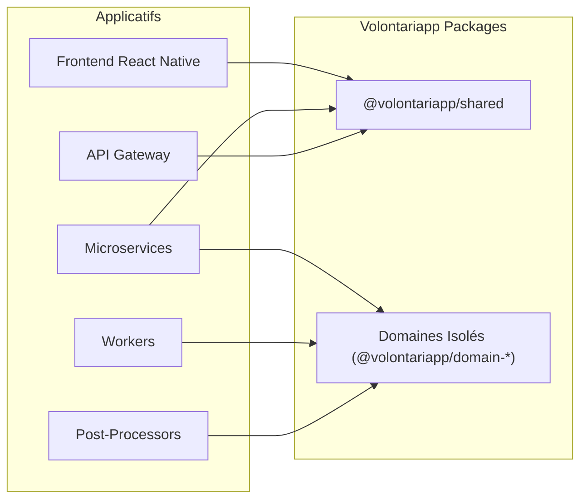
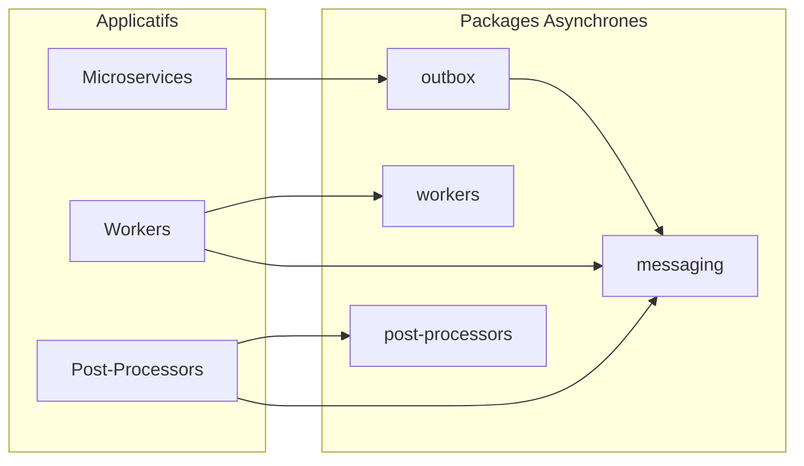
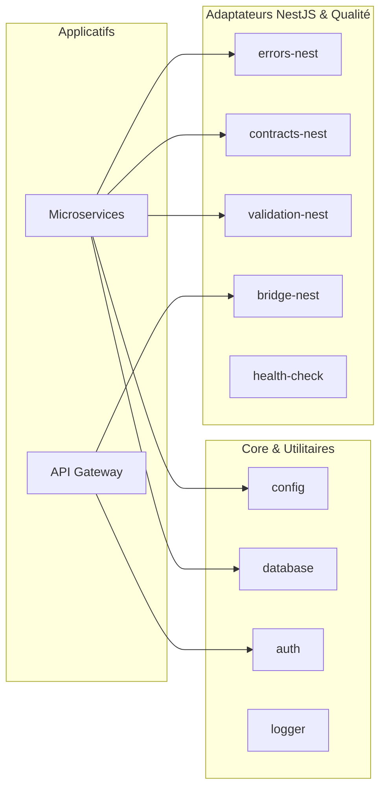

# Volontariapp - NPM Packages Monorepo

[](https://github.com/Volontariapp)
[](https://www.typescriptlang.org/)
[](https://gitnexus.vercel.app/)

## Project Overview & Value Proposition

Ce monorepo contient le cœur absolu de l'architecture de **Volontariapp**. 
L'objectif de ce dépôt est de centraliser la logique métier, l'infrastructure asynchrone et les contrats d'interface afin de garantir une architecture **DRY (Don't Repeat Yourself)**, modulaire et hautement résiliente.

Toutes les librairies ici sont conçues autour de principes stricts de **Clean Architecture** et de **Domain-Driven Design (DDD)**. 
En externalisant les domaines métiers et les mécanismes complexes (comme le pattern Outbox) dans ces packages NPM internes, nous garantissons que nos Microservices, nos API Gateways, nos Workers et notre Frontend (React Native) partagent exactement les mêmes règles et définitions, tout en restant déployables indépendamment.

---

## Architecture Globale & Dépendances

Afin de faciliter la lecture, les dépendances du monorepo sont réparties en 3 vues distinctes.

### 1. Consommation des Domaines & Contrats Partagés
Ce schéma illustre comment les composants applicatifs dépendent des contrats de base et de la logique métier pure (DDD).



### 2. Architecture Asynchrone (Outbox & Workers)
Ce schéma détaille le circuit des messages asynchrones entre les bases de données et les brokers d'événements.



### 3. Core, Utilitaires Node.js & Écosystème NestJS
Cette vue regroupe toutes les librairies agnostiques de bas niveau ainsi que les adaptateurs spécifiques au framework NestJS.



---

## Catalogue des Packages Internes

Cliquez sur les liens ci-dessous pour consulter la documentation détaillée de chaque composant, ses diagrammes d'architecture et ses exemples d'utilisation.

### Domaines Métiers Isolés (Core Domain)
Ces packages encapsulent les règles métiers pures (Entités, Value Objects, Domain Services). Ils sont totalement agnostiques de l'infrastructure (pas de HTTP, pas de requêtes SQL directes).
- [`@volontariapp/domain-event`](packages/domain-event/README.md) : Gestion du cycle de vie des Événements.
- [`@volontariapp/domain-post`](packages/domain-post/README.md) : Logique de publication et de modération des Actualités.
- [`@volontariapp/domain-social`](packages/domain-social/README.md) : Validation des relations et du graphe d'amis.
- [`@volontariapp/domain-user`](packages/domain-user/README.md) : Modélisation stricte de l'Identité et du Profil.

### Asynchronisme & Event-Driven (Outbox Pattern)
Ces packages orchestrent le flux asynchrone pour garantir la cohérence des données (Problème de la double écriture).
- [`@volontariapp/outbox`](packages/outbox/README.md) : L'implémentation robuste du Transactional Outbox Pattern (Dispatch, Polling, Pushing vers Redis).
- [`@volontariapp/workers`](packages/workers/README.md) : Les classes de base pour consommer les jobs via BullMQ et maintenir la traçabilité SQL (Audit).
- [`@volontariapp/post-processors`](packages/post-processors/README.md) : Traitements asynchrones réagissant aux événements métier finalisés.
- [`@volontariapp/messaging`](packages/messaging/README.md) : Validation des payloads événementiels circulant dans le bus de messages.

### Core & Agnostiques (Pure Node.js)
Ces librairies sont exécutables n'importe où, y compris dans des scripts légers sans dépendre de frameworks lourds.
- [`@volontariapp/auth`](packages/auth/README.md) : Analyse et validation cryptographique JWT.
- [`@volontariapp/config`](packages/config/README.md) : Validation des variables d'environnement (Fail Fast).
- [`@volontariapp/crypto`](packages/crypto/README.md) : Utilitaires de chiffrement, hachage et sécurisation des données.
- [`@volontariapp/database`](packages/database/README.md) : Centralisation des connexions TypeORM et utilitaires SQL.
- [`@volontariapp/logger`](packages/logger/README.md) : Service de journalisation structuré et agnostique.
- [`@volontariapp/shared`](packages/shared/README.md) : **Partagé avec le Frontend**. Contient les DTOs, Enums et contrats communs.

### Gestion d'Erreurs & Utilitaires NestJS
- [`@volontariapp/errors`](packages/errors/README.md) : Standardisation absolue de `DomainError` et `InfrastructureError`.
- [`@volontariapp/errors-nest`](packages/errors-nest/README.md) : Filtres globaux NestJS pour traduire les erreurs standard en codes HTTP.
- [`@volontariapp/validation-nest`](packages/validation-nest/README.md) : Pipes et validateurs personnalisés pour les contrôleurs NestJS.
- [`@volontariapp/contracts`](packages/contracts/README.md) : Typages générés à partir des définitions Protobuf (gRPC).
- [`@volontariapp/contracts-nest`](packages/contracts-nest/README.md) : Wrappers pour instancier les clients gRPC dans NestJS.
- [`@volontariapp/bridge`](packages/bridge/README.md) : Logique de communication transversale bas niveau.
- [`@volontariapp/bridge-nest`](packages/bridge-nest/README.md) : Connecteurs Bridge injectables pour le framework NestJS.

### Qualité & Observabilité
- [`@volontariapp/eslint-config`](packages/eslint-config/README.md) : Normes de qualité statique transverses.
- [`@volontariapp/monitoring`](packages/monitoring/README.md) : Implémentation du Distributed Tracing via OpenTelemetry.
- [`@volontariapp/health-check`](packages/health-check/README.md) : Logique de sondes de vitalité pures.
- [`@volontariapp/health-check-nest`](packages/health-check-nest/README.md) : Terminus et contrôleurs de vitalité pour NestJS.
- [`@volontariapp/testing`](packages/testing/README.md) : Outils partagés pour simplifier les tests unitaires et E2E.

---

## Cycle de Vie des Paquets & CI/CD Stricte

Ce monorepo impose des règles absolues concernant le versionnage pour empêcher de casser la production.

> [!CAUTION]
> **Règle d'or du Versioning** :
> Toute modification de code nécessite l'ajout d'un **Changeset** via `yarn changeset add`.
> Il est **formellement interdit** de publier ou de "bump" manuellement la version d'un package sans que le pipeline d'intégration continue ne soit passé avec succès.

### Flux de travail développeur
1. Modifications dans un ou plusieurs sous-packages.
2. Lancer `yarn build` pour s'assurer de l'absence d'erreurs TypeScript croisées.
3. Lancer `yarn changeset add` et décrire la nature du changement (patch/minor/major).
4. Lancer `yarn changeset version` pour appliquer et synchroniser la nouvelle version.
5. Pousser sur une PR. La CI (GitHub Actions) exécutera le linting, les tests, et créera automatiquement une PR de release.

---

## Intelligence de Code (GitNexus)

Ce projet utilise **GitNexus** pour cartographier les relations entre les librairies partagées et détecter l'impact des changements sur l'ensemble de l'écosystème Volontariapp.

Pour visualiser le graphe localement :
```bash
npx gitnexus serve
```
Ou visitez [GitNexus Dashboard](https://gitnexus.vercel.app/).

---
