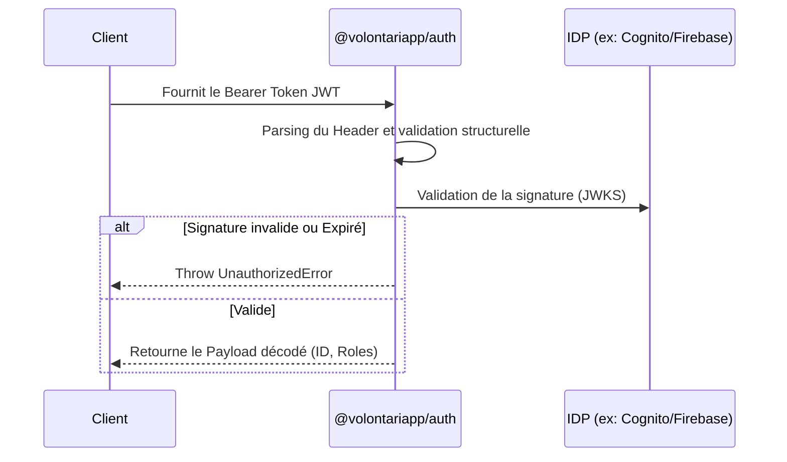

# @volontariapp/auth

## Overview
Package `auth` fournissant des utilitaires d'authentification agnostiques en pur Node.js/TypeScript. 
Contrairement aux solutions fortement couplées, ce package est indépendant de tout framework (notamment NestJS). Cette agnosie permet d'embarquer des fonctions de vérification JWT dans des environnements d'exécution légers (Scripts, Workers sans NestJS, ou API Gateway).

## Flux d'Authentification



## Key Features
- **Validation JWT** : Fonctions robustes d'analyse, de décodage et de vérification cryptographique des jetons d'accès.
- **Role-Based Access Control (RBAC)** : Utilitaires pour vérifier l'appartenance à un rôle dans les claims du token.
- **Agnostique** : Aucune dépendance à `@nestjs/common` ni au contexte d'exécution HTTP.

## Exemple d'Utilisation

L'utilisation se fait de manière fonctionnelle ou via instanciation de service autonome.

```typescript
import { JwtVerifier } from '@volontariapp/auth';

const verifier = new JwtVerifier({
  jwksUri: 'https://idp.example.com/.well-known/jwks.json',
  issuer: 'https://idp.example.com',
  audience: 'volontariapp-api'
});

async function authenticateRequest(token: string) {
  try {
    const payload = await verifier.verify(token);
    
    if (!payload.roles.includes('ADMIN')) {
       throw new Error('Forbidden: Insufficient privileges');
    }
    
    return payload.userId;
  } catch (error) {
    throw new Error('Unauthorized');
  }
}
```
