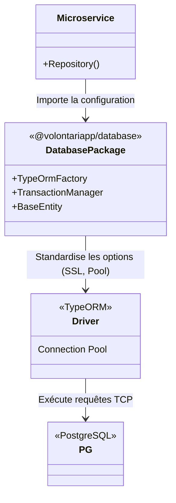

# @volontariapp/database

## Overview
Le package `database` centralise toute la configuration, les adaptateurs et les utilitaires liés à la persistance relationnelle de données.
L'infrastructure globale de Volontariapp reposant sur **TypeORM** (et PostgreSQL en production), ce package évite la duplication des configurations de pooling, de logging SQL, et des helpers de migration dans chaque microservice.

## Architecture d'Accès aux Données



## Key Features
- **Factories TypeORM Standardisées** : Configurations communes prêtes à l'emploi (logging unifié, SSL configs, Pool size dynamique).
- **Utilitaires de Transaction** : Helpers pour propager le contexte transactionnel (EntityManager) de manière propre.
- **Entities de Base** : Classes abstraites contenant les champs génériques (ex: `createdAt`, `updatedAt`, `id`).

## Exemple d'Utilisation

### Utilisation de la Configuration Commune

Au lieu de recoder les spécificités de connexion PostgreSQL dans chaque microservice, on utilise la Factory partagée :

```typescript
import { createTypeOrmOptions } from '@volontariapp/database';
import { TypeOrmModule } from '@nestjs/typeorm';

@Module({
  imports: [
    TypeOrmModule.forRootAsync({
      useFactory: (configService: ConfigService) => {
        // Applique les standards de Volontariapp (SSL, Pool, Naming Strategy)
        return createTypeOrmOptions({
          url: configService.get('DATABASE_URL'),
          entities: [__dirname + '/**/*.entity{.ts,.js}'],
          migrationsRun: true, // Auto-migration au boot
        });
      },
      inject: [ConfigService],
    }),
  ],
})
export class AppModule {}
```
