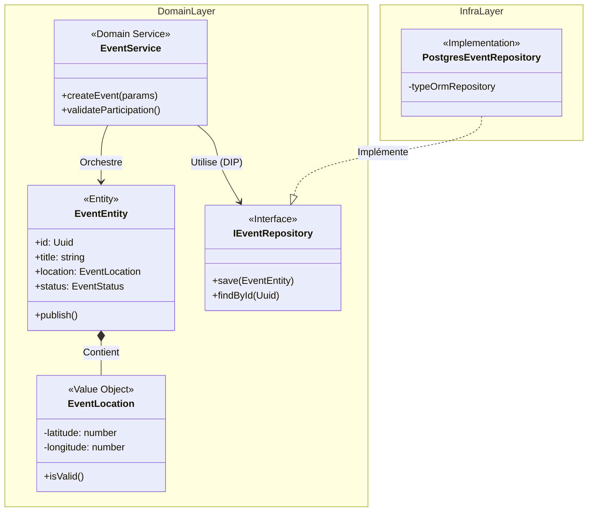

# @volontariapp/domain-event

## Overview & Domain Driven Design (DDD)

Le package `domain-event` encapsule la **logique métier centrale absolue** relative aux **Événements** (Events) de la plateforme Volontariapp. 
Conçu selon les principes stricts de la **Clean Architecture** et du **Domain-Driven Design (DDD)**, ce domaine est complètement **agnostique de l'infrastructure**. Il ne connaît ni NestJS, ni TypeORM, ni gRPC.

Ce package est partagé transversalement (DRY) entre :
- Le microservice métier (`ms-event`)
- Les Workers asynchrones
- Les Post-Processors

> [!TIP]
> **Pourquoi cette isolation ?**
> Si l'API HTTP/gRPC tombe en panne, ou si le framework change, les Workers et le domaine continuent de fonctionner de manière totalement autonome grâce à cette isolation stricte de la logique métier.

## Architecture du Domaine



## Structure des Dossiers

```text
src/
├── entities/           # Entités mutables du domaine (ex: EventEntity, TagEntity)
├── value-objects/      # Objets immuables validant des règles précises (ex: EventLocation)
├── services/           # Domain Services pour la logique impliquant plusieurs entités
├── repositories/       # Interfaces des Repositories (Contrats) et implémentations Infra
├── models/             # Modèles DTOs / Mappers
├── database/           # Définition des triggers ou logiques SQL pures (si applicables)
└── test/               # Factories et mocks du domaine
```

## Exemples d'Implémentation

### 1. Value Object & Entity
L'utilisation de Value Objects empêche le passage de types primitifs (Primitive Obsession) et garantit que seules des données valides existent en mémoire.

```typescript
// value-objects/event-location.value-object.ts
export class EventLocation {
  constructor(
    public readonly latitude: number,
    public readonly longitude: number
  ) {
    if (latitude < -90 || latitude > 90) throw new DomainError('Invalid latitude');
    if (longitude < -180 || longitude > 180) throw new DomainError('Invalid longitude');
  }
}

// entities/event.entity.ts
export class EventEntity {
  constructor(
    public readonly id: string,
    public title: string,
    public location: EventLocation // Typage fort, impossible d'avoir une string
  ) {}

  public relocate(newLocation: EventLocation): void {
    // Logique métier encapsulée dans l'entité
    this.location = newLocation;
  }
}
```

### 2. Domain Service
Le service de domaine orchestre les règles qui ne rentrent pas dans une seule entité, en utilisant des abstractions (Inversion de Dépendance).

```typescript
// services/event-creation.service.ts
export class EventCreationService {
  constructor(
    private readonly eventRepo: IEventRepository,
    private readonly userSvc: IUserServiceStub
  ) {}

  async create(userId: string, payload: CreateEventPayload): Promise<EventEntity> {
    const user = await this.userSvc.getUserStatus(userId);
    if (!user.isVerified) {
      throw new DomainError('USER_NOT_VERIFIED', 'Unverified users cannot create events');
    }

    const location = new EventLocation(payload.lat, payload.lng);
    const event = new EventEntity(uuidv4(), payload.title, location);
    
    await this.eventRepo.save(event);
    return event;
  }
}
```
