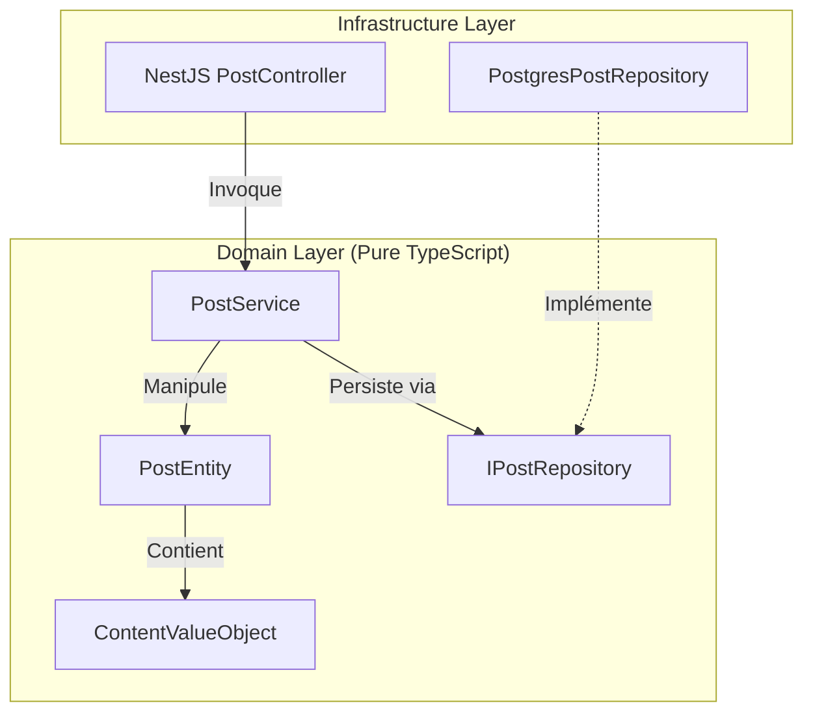

# @volontariapp/domain-post

## Overview & Domain Driven Design (DDD)

Le package `domain-post` contient la **logique métier absolue** relative aux **Actualités (Posts)**. 
Tout comme les autres packages de domaine, il est construit autour des principes de la **Clean Architecture**. Il garantit une isolation parfaite entre les règles de gestion d'un Post et la tuyauterie de l'infrastructure (serveur HTTP, bases de données, Kafka/Redis).

Ce package est partagé entre :
- `ms-post` (API)
- Les Workers asynchrones de traitement d'images/posts
- Les Post-Processors (Notifications, Flux)

## Architecture du Domaine



## Structure des Dossiers

```text
src/
├── entities/           # PostEntity, CommentEntity, LikeEntity
├── value-objects/      # PostContent (validation de longueur, profanité)
├── services/           # FeedGenerationService, PostModerationService
├── repositories/       # Interfaces (IPostRepository) et Implémentations SQL
└── test/               # Stubs et Factories
```

## Exemples d'Implémentation

### L'Entité Post et l'encapsulation

```typescript
// entities/post.entity.ts
export class PostEntity {
  private constructor(
    public readonly id: string,
    public readonly authorId: string,
    public content: PostContent, // Value Object
    public isPublished: boolean
  ) {}

  // Constructeur statique pour forcer la validation à la création
  public static create(authorId: string, contentText: string): PostEntity {
    const content = new PostContent(contentText);
    return new PostEntity(uuidv4(), authorId, content, false);
  }

  public publish(): void {
    if (this.content.isEmpty()) {
      throw new DomainError('POST_EMPTY', 'Cannot publish an empty post');
    }
    this.isPublished = true;
  }
}
```
