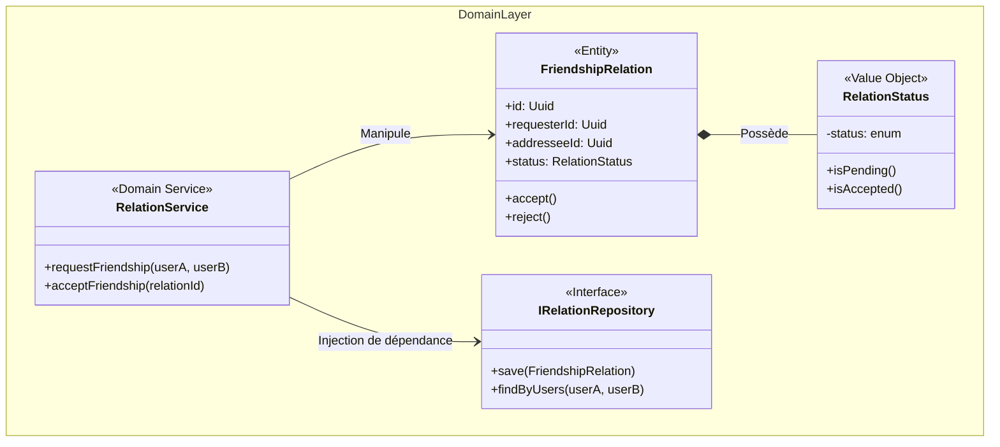

# @volontariapp/domain-social

## Overview & Domain Driven Design (DDD)

Le package `domain-social` isole la **logique métier absolue** relative au **Graphe Social** (demandes d'amis, abonnements, relations). 
Cette logique est complexe (validation croisée des états des deux utilisateurs) et requiert une isolation parfaite vis-à-vis des bases de données orientées graphes (ex: Neo4j) utilisées par l'infrastructure.

Ce domaine métier (DRY) est partagé entre :
- `ms-social` (API HTTP/gRPC)
- Les Workers asynchrones de synchronisation relationnelle
- Les Post-Processors (Notifications de demandes d'amis)

## Architecture du Domaine



## Structure des Dossiers

```text
src/
├── entities/           # Entités du graphe social (FriendshipRelation, FollowRelation)
├── value-objects/      # Status, Type de relation
├── services/           # Logique métier orchestrant plusieurs noeuds (RelationService)
├── repositories/       # Contrats d'accès aux données (IRelationRepository)
└── test/               # Spies et Mocks pour tester le domaine isolé
```

## Exemples d'Implémentation

### Règle Métier dans l'Entité

```typescript
// entities/friendship-relation.entity.ts
export class FriendshipRelation {
  constructor(
    public readonly id: string,
    public readonly requesterId: string,
    public readonly addresseeId: string,
    public status: RelationStatus // Value Object
  ) {
    if (requesterId === addresseeId) {
      throw new DomainError('INVALID_RELATION', 'User cannot befriend themselves');
    }
  }

  public accept(): void {
    if (!this.status.isPending()) {
      throw new DomainError('INVALID_TRANSITION', 'Only pending requests can be accepted');
    }
    this.status = RelationStatus.ACCEPTED();
  }
}
```
