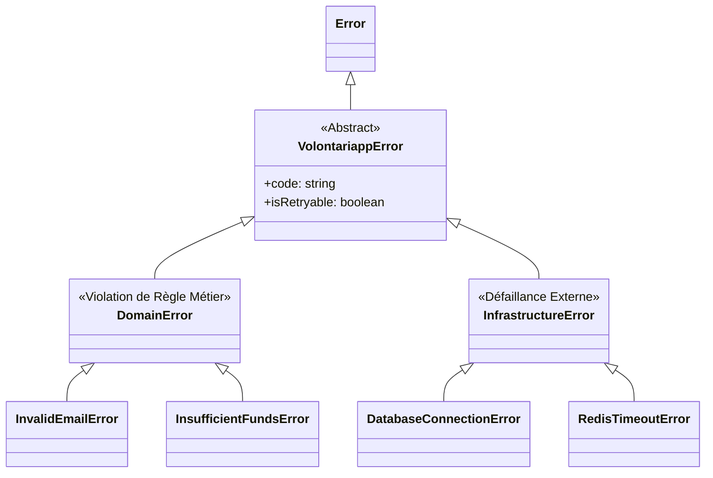

# @volontariapp/errors

## Overview
Ce package centralise les définitions des **erreurs métiers et d'infrastructure** pour l'intégralité du backend.
L'objectif est d'interdire l'utilisation d'erreurs génériques (comme `throw new Error('message')`) et d'imposer un typage strict et sémantique des défaillances. Ceci permet une observabilité parfaite et une traduction cohérente des erreurs en codes HTTP par les couches supérieures (ex: API Gateway).

## Hiérarchie des Exceptions



## Key Features
- **`DomainError`** : Pour toute violation des invariants du domaine (ex: "L'utilisateur n'a pas l'âge requis", "Le mot de passe est trop court"). Ces erreurs sont souvent traduites en HTTP 4xx (Client Error).
- **`InfrastructureError`** : Pour les échecs techniques (ex: "Base de données injoignable", "Service gRPC timeout"). Traduites en HTTP 5xx (Server Error).
- **Interopérabilité** : Facilite le filtrage des logs (on alerte sur l'Infrastructure, on monitore le Domaine).

## Exemple d'Utilisation

Dans un **Domain Service** ou un **Value Object** :

```typescript
import { DomainError, InfrastructureError } from '@volontariapp/errors';

export class PaymentService {
  async processPayment(amount: number) {
    if (amount <= 0) {
      // Violation d'une règle métier explicite
      throw new DomainError('INVALID_AMOUNT', 'Le montant doit être supérieur à zéro.');
    }
    
    try {
      await this.paymentGateway.charge(amount);
    } catch (e) {
      // Masque l'erreur de la lib tierce derrière un type standard
      throw new InfrastructureError(
        'PAYMENT_GATEWAY_DOWN',
        'Impossible de contacter Stripe',
        { isRetryable: true, originalError: e }
      );
    }
  }
}
```
