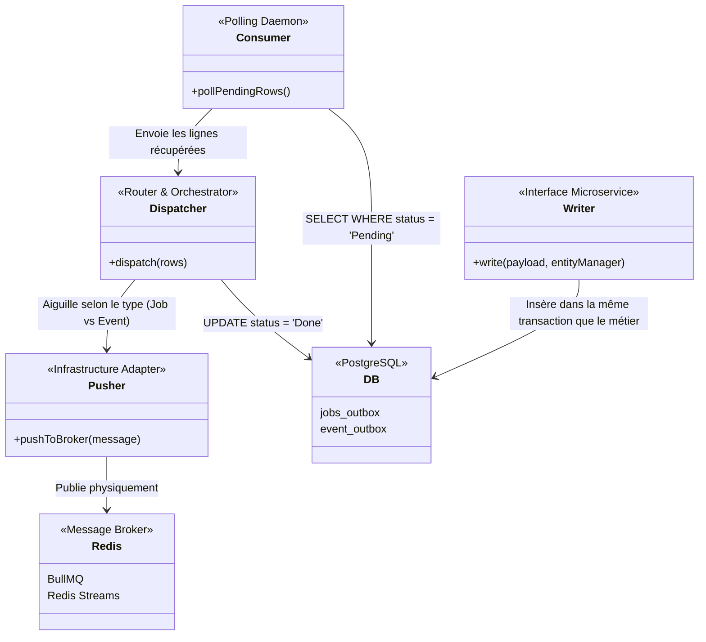
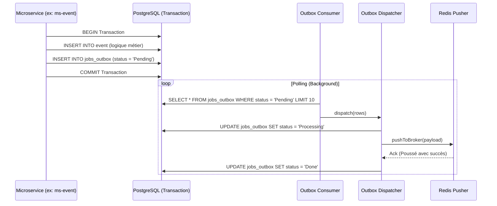

# @volontariapp/outbox

## Overview & The Transactional Outbox Pattern

Le package `outbox` est le pilier central de l'architecture asynchrone et événementielle de Volontariapp. 
Il résout le **Problème de la Double Écriture (Dual Write Problem)** : comment garantir qu'une entité métier est sauvegardée en base ET qu'un message/job est bien envoyé à Redis/BullMQ sans risque d'incohérence si l'un des deux systèmes tombe ?

La solution implémentée ici est agnostique de NestJS (Node.js pur) pour des performances optimales et une séparation claire des responsabilités.

## Architecture et Rôles des Composants

L'architecture interne de l'Outbox est divisée en plusieurs responsabilités claires, du polling de la base de données jusqu'à l'envoi physique dans le Broker (Redis).



### Détail des Composants
- **Writers** : Utilisés par les microservices (ex: `ms-event`) pour insérer une intention d'action asynchrone (Job ou Domain Event) dans la même transaction SQL que l'action métier.
- **Consumers** : Boucles infinies tournant en tâche de fond (ou dans un Cron Kubernetes) qui lisent les tables d'outbox à la recherche de lignes `Pending`.
- **Dispatchers** : Reçoivent les lignes du Consumer. Ils orchestrent la logique de retry et décident à quel Pusher déléguer (ex: un Job va dans BullMQ, un Domain Event va dans un Redis Stream). Une fois poussé avec succès, le Dispatcher marque la ligne comme `Done` en SQL.
- **Pushers** : Adaptateurs de bas niveau responsables de la connexion réseau avec Redis/Kafka pour l'envoi du binaire/JSON.

## Flux d'Exécution (Séquence)



## Structure des Dossiers

```text
src/
├── writers/          # Classes utilisées par les MS pour écrire dans la DB Outbox
├── consumers/        # Boucles de polling récupérant les lignes de DB 'Pending'
├── dispatchers/      # Logique de routage vers BullMQ ou Redis Stream
├── pushers/          # Classes poussant physiquement vers Redis
└── repositories/     # Accès direct aux tables `jobs_outbox` / `event_outbox`
```

## Exemple d'Implémentation

### Écriture Transactionnelle depuis un Microservice

Le microservice utilise le `Writer` fourni par la librairie en lui passant le gestionnaire de transaction TypeORM (EntityManager).

```typescript
import { JobsOutboxWriter } from '@volontariapp/outbox';

export class EventService {
  async createEventWithJob(payload: any, manager: EntityManager) {
    // 1. Sauvegarde métier classique
    const event = await manager.save(EventEntity, payload);
    
    // 2. Écriture du Job de façon transactionnelle
    const writer = new JobsOutboxWriter(manager);
    await writer.write({
      queueName: 'event-processing',
      jobName: 'notify-followers',
      payload: { eventId: event.id },
      options: { delay: 5000 }
    });
    // Si la transaction échoue, le job n'est pas inséré : Cohérence absolue.
  }
}
```
