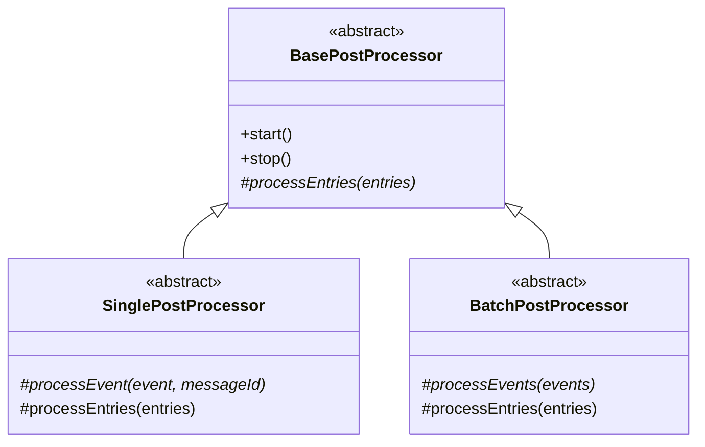
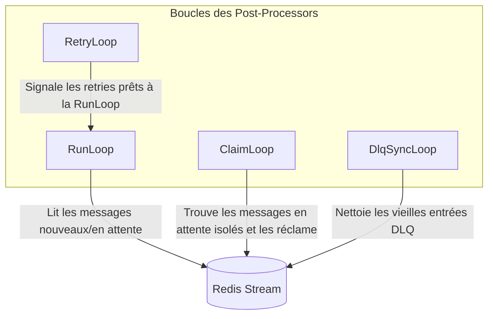
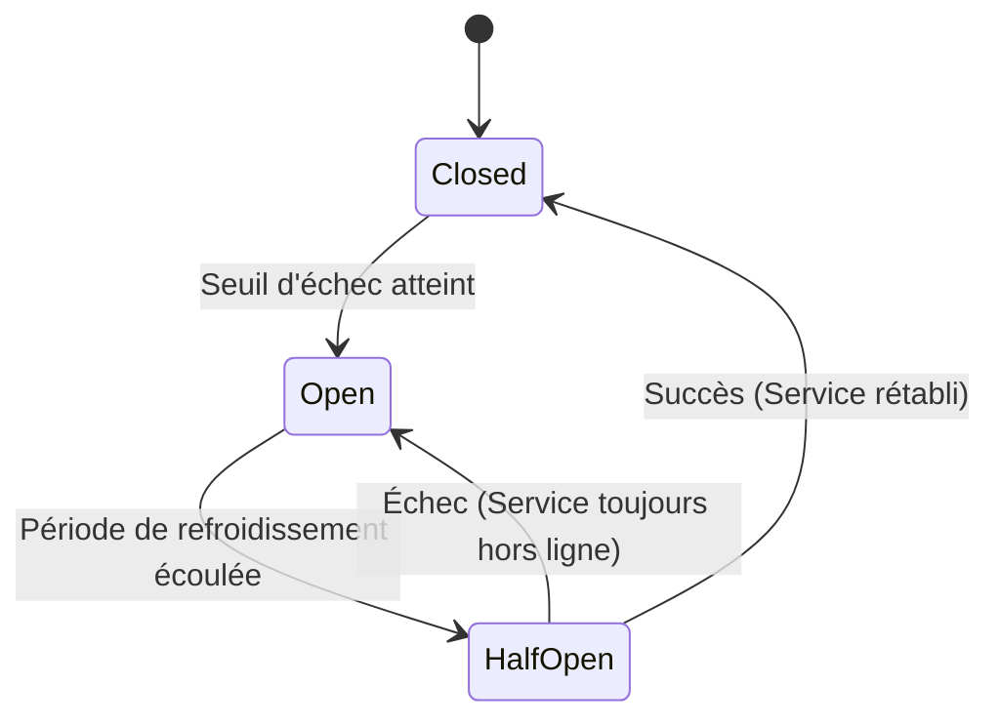
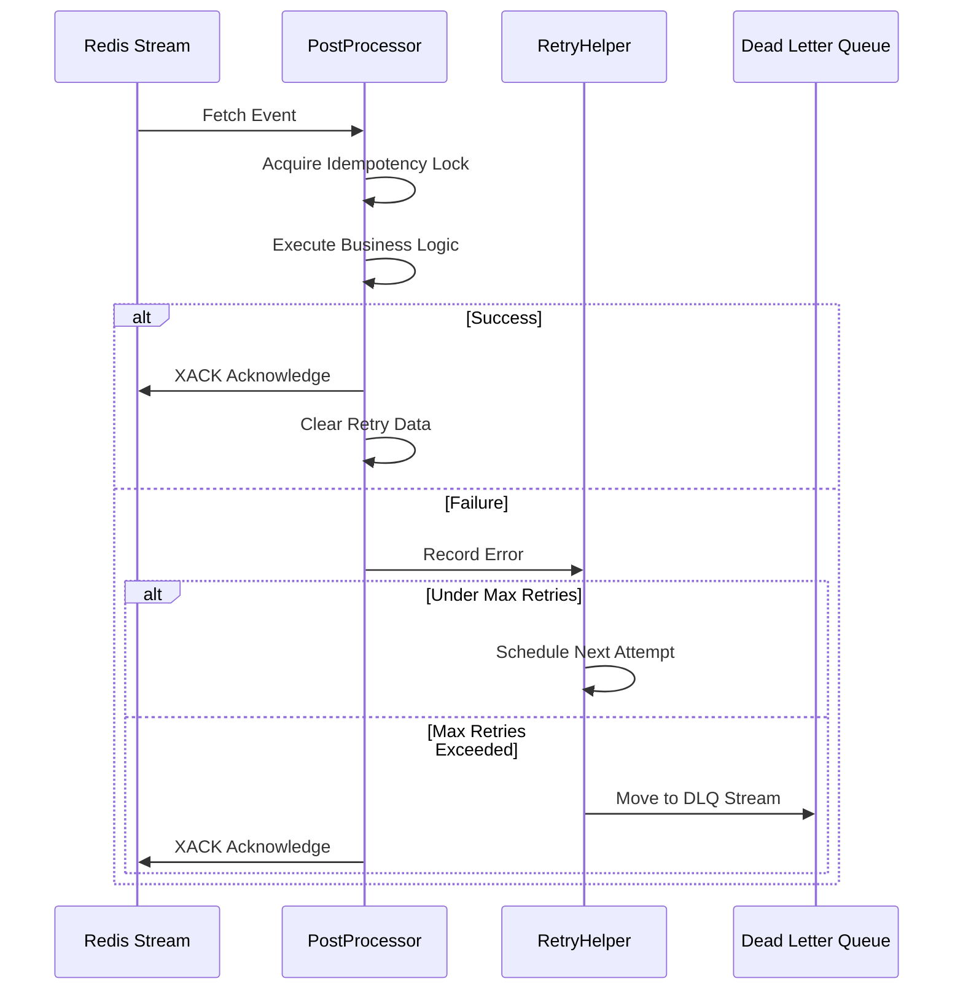

# Package Post-Processors

## Aperçu (Overview)

Le package `post-processors` fournit une fondation robuste, scalable et résiliente pour le traitement asynchrone des événements via Redis Streams. Il est conçu pour gérer une consommation d'événements à haut débit avec une tolérance aux pannes intégrée, un traitement par lots dynamique (batching), un disjoncteur (circuit breaker), de l'idempotence et la gestion des files d'attente de lettres mortes (DLQ).

## Architecture

L'architecture est construite autour d'une classe abstraite de base qui gère l'orchestration complexe des Redis Streams, permettant aux développeurs de se concentrer uniquement sur la logique métier du traitement des événements (un par un ou par lots).



### Types de Traitement

1. **SinglePostProcessor** : Traite les événements séquentiellement, un par un. Idéal pour les opérations qui ne peuvent pas être traitées par lots (ex: envoi d'emails individuels) ou lorsqu'une isolation stricte entre les événements est requise.
2. **BatchPostProcessor** : Accumule un lot d'événements et les traite ensemble. Fortement recommandé pour les opérations I/O (comme les insertions en base de données ou les appels d'API en masse) afin de maximiser le débit et minimiser la latence.

## Mécanismes Internes et Boucles

Pour garantir qu'aucun événement ne soit perdu ou bloqué de façon permanente, le `BasePostProcessor` orchestre quatre boucles parallèles en arrière-plan.



- **RunLoop** : La boucle de consommation principale. Elle interroge continuellement le flux Redis pour de nouveaux messages avec `XREADGROUP`. Elle ajuste dynamiquement la taille des lots en fonction de la mémoire système, de la charge CPU et de la latence de traitement.
- **ClaimLoop** : Un mécanisme de récupération. Elle scanne le groupe de consommateurs à la recherche de messages qui sont restés "en attente" (assignés à un consommateur) trop longtemps. Cela se produit si un consommateur plante avant d'acquitter (ACK) un message. La boucle réclame ces messages orphelins pour qu'ils soient traités par un consommateur sain.
- **RetryLoop** : Gère les nouvelles tentatives différées (retries). Lorsque le traitement échoue, le message est planifié pour une nouvelle tentative avec un backoff exponentiel. Cette boucle détecte quand le temps d'attente est écoulé et demande à la RunLoop de récupérer à nouveau le message.
- **DlqSyncLoop** : Gère la Dead Letter Queue (DLQ). Les messages qui épuisent toutes leurs tentatives de retry sont déplacés vers la DLQ. Cette boucle nettoie périodiquement les entrées DLQ expirées selon la politique de rétention pour éviter l'épuisement de la mémoire dans Redis.

## Tolérance aux Pannes et Idempotence

Le package inclut des mécanismes complets pour gérer gracieusement les défaillances.

### Pattern Circuit Breaker (Disjoncteur)

Dans les systèmes distribués, un post-processor dépend souvent de services externes (bases de données, API tierces, autres microservices). Lorsque ces services en aval subissent une dégradation ou échouent totalement, continuer à envoyer des requêtes peut entraîner des défaillances en cascade :
1. **Épuisement des Ressources** : Le post-processor gaspille du CPU, de la mémoire et des connexions réseau à attendre des timeouts.
2. **Surcharge du Système** : Le service en difficulté est matraqué de trafic qu'il ne peut pas gérer, ce qui l'empêche de récupérer.

Pour protéger à la fois le post-processor et les systèmes en aval, le `BasePostProcessor` implémente le pattern **Circuit Breaker**. Il surveille les taux de succès et d'échec du traitement des événements.



#### Comment ça marche :

- **État Fermé (Fonctionnement Normal)** : Le circuit est fermé, permettant à l'électricité (messages) de circuler. La `RunLoop` récupère et traite les événements normalement. Le disjoncteur compte les échecs récents.
- **État Ouvert (Défaillance Détectée)** : Si le taux d'échec dépasse un seuil prédéfini dans une fenêtre de temps spécifique, le circuit "saute" et s'ouvre. La `RunLoop` suspend immédiatement la récupération de nouveaux messages. Cela donne au service défaillant le temps de récupérer sans être surchargé.
- **État Semi-Ouvert (Test de Récupération)** : Après une période de refroidissement (cooldown), le circuit passe dans un état semi-ouvert. Il laisse passer un nombre limité de messages de test.
  - Si ces messages réussissent, le circuit suppose que le service en aval est de nouveau sain et repasse à l'**État Fermé**.
  - Si les messages échouent, le circuit repasse immédiatement à l'**État Ouvert** pour une autre période de refroidissement.



### Fonctionnalités Clés
- **Idempotence** : Utilise des verrous Redis (locks) pour garantir que même si un message est livré plusieurs fois (at-least-once delivery), il n'est traité qu'une seule fois.
- **Circuit Breaker** : Interrompt automatiquement la consommation si un seuil élevé d'erreurs est atteint, évitant les pannes en cascade.
- **Backoff Exponentiel** : Décale progressivement les tentatives de retry pour laisser le temps aux services défaillants de récupérer.

## Utilisation avec NestJS

L'intégration d'un post-processor dans une application NestJS implique la création d'un service qui étend soit `SinglePostProcessor` soit `BatchPostProcessor` et la gestion de son cycle de vie.

### 1. Créer le Service Post-Processor

```typescript
import { Injectable, OnModuleInit, OnModuleDestroy } from '@nestjs/common';
import { SinglePostProcessor } from '@volontariapp/post-processors';
import type { StreamEvent } from '@volontariapp/messaging';
import Redis from 'ioredis';
import { Logger } from '@nestjs/common';

@Injectable()
export class UserAnalyticsPostProcessor extends SinglePostProcessor implements OnModuleInit, OnModuleDestroy {
  private readonly nestLogger = new Logger(UserAnalyticsPostProcessor.name);

  constructor(private readonly redisClient: Redis) {
    super(
      {
        streamName: 'events:user',
        groupName: 'analytics-group',
        consumerName: `consumer-${process.pid}`,
        batchSize: 50,
        claimIntervalMs: 10000,
        claimMinIdleTimeMs: 30000,
        idempotencyTtlSeconds: 86400,
        retry: {
          maxRetries: 3,
          initialDelayMs: 2000,
          maxDelayMs: 60000,
          backoffMultiplier: 2,
          enableDlq: true,
        },
        dynamicBatching: {
          enabled: true,
          minBatchSize: 10,
          maxBatchSize: 100,
          targetLatencyMs: 500,
        }
      },
      redisClient,
      // Adapt NestJS Logger to the expected Logger interface
      {
        info: (msg, meta) => this.nestLogger.log(msg, meta),
        error: (msg, meta) => this.nestLogger.error(msg, meta),
        warn: (msg, meta) => this.nestLogger.warn(msg, meta),
        debug: (msg, meta) => this.nestLogger.debug(msg, meta),
      }
    );
  }

  async onModuleInit() {
    await this.start();
  }

  async onModuleDestroy() {
    await this.stop();
  }

  protected shouldProcess(eventType: string): boolean {
    return eventType === 'USER_CREATED';
  }

  protected async processEvent(event: StreamEvent<any>, messageId: string): Promise<void> {
    this.nestLogger.log(`Processing event ID: ${event.id}`);
    // Implémentez la logique métier ici
  }
}
```

### 2. Enregistrer dans un Module

```typescript
import { Module } from '@nestjs/common';
import { UserAnalyticsPostProcessor } from './user-analytics.post-processor';
import { RedisModule } from './redis.module'; // Suppose que vous avez un module fournissant Redis

@Module({
  imports: [RedisModule],
  providers: [UserAnalyticsPostProcessor],
})
export class AnalyticsModule {}
```

En s'accrochant à `OnModuleInit` et `OnModuleDestroy`, le cycle de vie de l'application NestJS démarrera automatiquement les boucles en arrière-plan lorsque l'application démarre et les arrêtera proprement lors de son arrêt.
