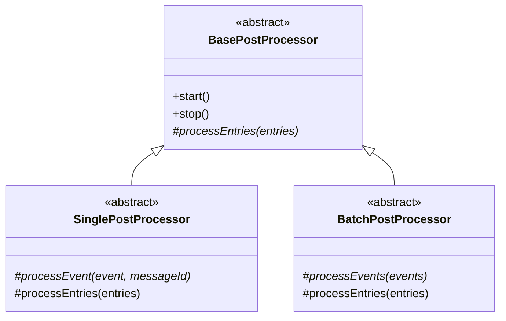
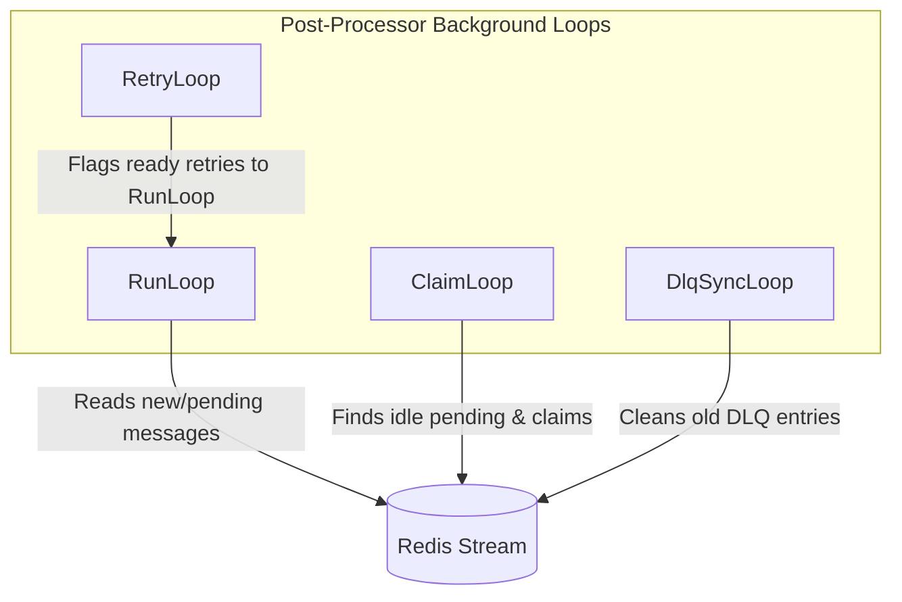
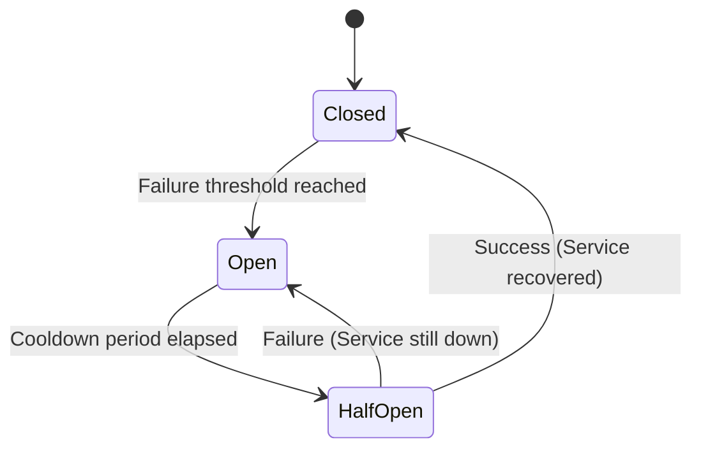
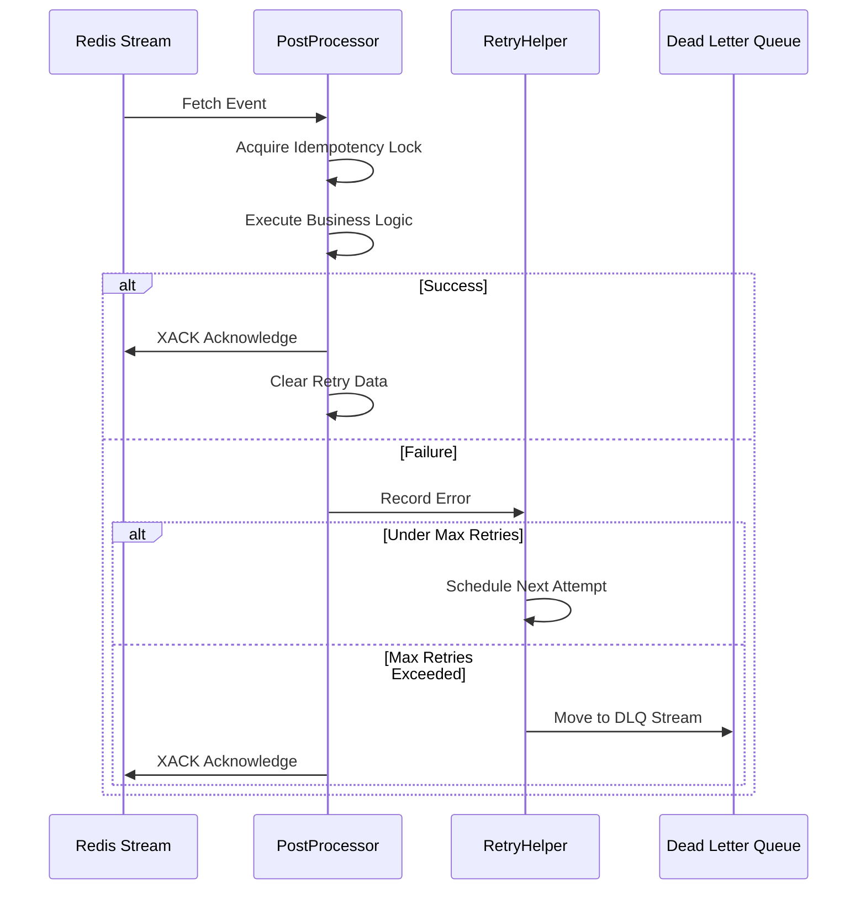

# Post-Processors Package

## Overview

The `post-processors` package provides a robust, scalable, and resilient foundation for processing events asynchronously using Redis Streams. It is designed to handle high-throughput event consumption with built-in fault tolerance, dynamic batching, circuit breaking, idempotency, and dead-letter queue (DLQ) management.

## Architecture

The architecture is built around a base abstract class that manages the complex orchestration of Redis Streams, allowing developers to focus solely on the business logic of processing events (either one by one or in batches).



### Processing Types

1. **SinglePostProcessor**: Processes events sequentially, one at a time. Ideal for operations that cannot be batched (e.g., sending individual emails) or when strict isolation between events is required.
2. **BatchPostProcessor**: Accumulates a batch of events and processes them together. Highly recommended for I/O operations (like database inserts or bulk API calls) to maximize throughput and minimize latency.

## Internal Mechanics and Loops

To guarantee that no event is lost or permanently stuck, the `BasePostProcessor` orchestrates four parallel background loops.



- **RunLoop**: The main consumption loop. It continuously polls the Redis stream for new messages using `XREADGROUP`. It dynamically adjusts the batch size based on system memory, CPU load, and processing latency.
- **ClaimLoop**: A recovery mechanism. It scans the consumer group for messages that have been "pending" (assigned to a consumer) for too long. This happens if a consumer crashes before acknowledging a message. The loop claims these orphaned messages so they can be processed by a healthy consumer.
- **RetryLoop**: Manages delayed retries. When processing fails, the message is scheduled for a retry with exponential backoff. This loop detects when the wait time is over and instructs the RunLoop to re-fetch the message.
- **DlqSyncLoop**: Maintains the Dead Letter Queue (DLQ). Messages that exhaust all retry attempts are moved to the DLQ. This loop periodically cleans up expired DLQ entries based on the retention policy to prevent memory exhaustion in Redis.

## Fault Tolerance and Idempotency

The package includes comprehensive mechanisms to handle failures gracefully.

### Circuit Breaker Pattern

In distributed systems, a post-processor often depends on external services (databases, third-party APIs, or other microservices). When these downstream services experience degradation or fail entirely, continuing to send requests can lead to cascading failures:
1. **Resource Exhaustion**: The post-processor wastes CPU, memory, and network connections waiting for timeouts.
2. **System Overload**: The struggling downstream service is hammered with traffic it cannot handle, preventing its recovery.

To protect both the post-processor and the downstream systems, the `BasePostProcessor` implements the **Circuit Breaker pattern**. It monitors the success and failure rates of the event processing.



#### How it works:

- **Closed State (Normal Operation)**: The circuit is closed, allowing electricity (messages) to flow. The `RunLoop` fetches and processes events normally. The circuit breaker counts recent failures.
- **Open State (Failure Detected)**: If the failure rate exceeds a predefined threshold within a specific time window, the circuit "trips" and opens. The `RunLoop` immediately suspends fetching new messages. This gives the failing downstream service time to recover without being overloaded.
- **Half-Open State (Recovery Testing)**: After a predefined cooldown period, the circuit transitions to a half-open state. It allows a limited number of test messages to pass through. 
  - If these test messages succeed, the circuit assumes the downstream service is healthy again and resets to the **Closed State**.
  - If the test messages fail, the circuit immediately trips back to the **Open State** for another cooldown period.



### Key Features
- **Idempotency**: Utilizes Redis locks to ensure that even if a message is delivered multiple times (at-least-once delivery), it is only processed once.
- **Circuit Breaker**: Halts consumption automatically if a high threshold of errors is reached, preventing cascading failures in downstream systems.
- **Exponential Backoff**: Delays retries progressively to give failing downstream services time to recover.

## Usage with NestJS

Integrating a post-processor into a NestJS application involves creating a service that extends either `SinglePostProcessor` or `BatchPostProcessor` and managing its lifecycle.

### 1. Create the Post-Processor Service

```typescript
import { Injectable, OnModuleInit, OnModuleDestroy } from '@nestjs/common';
import { SinglePostProcessor } from '@volontariapp/post-processors';
import type { StreamEvent } from '@volontariapp/messaging';
import Redis from 'ioredis';
import { Logger } from '@nestjs/common';

@Injectable()
export class UserAnalyticsPostProcessor extends SinglePostProcessor implements OnModuleInit, OnModuleDestroy {
  private readonly nestLogger = new Logger(UserAnalyticsPostProcessor.name);

  constructor(private readonly redisClient: Redis) {
    super(
      {
        streamName: 'events:user',
        groupName: 'analytics-group',
        consumerName: `consumer-${process.pid}`,
        batchSize: 50,
        claimIntervalMs: 10000,
        claimMinIdleTimeMs: 30000,
        idempotencyTtlSeconds: 86400,
        retry: {
          maxRetries: 3,
          initialDelayMs: 2000,
          maxDelayMs: 60000,
          backoffMultiplier: 2,
          enableDlq: true,
        },
        dynamicBatching: {
          enabled: true,
          minBatchSize: 10,
          maxBatchSize: 100,
          targetLatencyMs: 500,
        }
      },
      redisClient,
      // Adapt NestJS Logger to the expected Logger interface
      {
        info: (msg, meta) => this.nestLogger.log(msg, meta),
        error: (msg, meta) => this.nestLogger.error(msg, meta),
        warn: (msg, meta) => this.nestLogger.warn(msg, meta),
        debug: (msg, meta) => this.nestLogger.debug(msg, meta),
      }
    );
  }

  async onModuleInit() {
    await this.start();
  }

  async onModuleDestroy() {
    await this.stop();
  }

  protected shouldProcess(eventType: string): boolean {
    return eventType === 'USER_CREATED';
  }

  protected async processEvent(event: StreamEvent<any>, messageId: string): Promise<void> {
    this.nestLogger.log(`Processing event ID: ${event.id}`);
    // Implement business logic here
  }
}
```

### 2. Register in a Module

```typescript
import { Module } from '@nestjs/common';
import { UserAnalyticsPostProcessor } from './user-analytics.post-processor';
import { RedisModule } from './redis.module'; // Assume you have a module providing Redis

@Module({
  imports: [RedisModule],
  providers: [UserAnalyticsPostProcessor],
})
export class AnalyticsModule {}
```

By hooking into `OnModuleInit` and `OnModuleDestroy`, the NestJS application lifecycle will automatically start the background loops when the application boots and gracefully shut them down when it stops.
