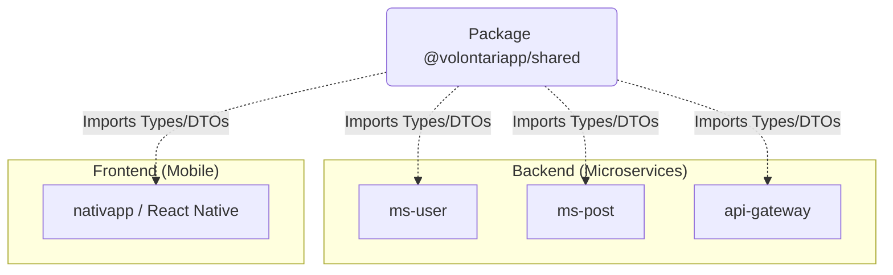

# @volontariapp/shared

## Overview
Le package `shared` est l'espace transverse par excellence. **C'est le seul package backend qui a vocation à être partagé avec le Front-End** (application mobile React Native `nativapp/`).
Il agit comme le "Contrat commun" entre tous les acteurs du système, garantissant que le client et le serveur parlent exactement le même langage (mêmes types, mêmes validations de base).

## Diagramme de Dépendance Transversale



## Key Features
- **Interfaces Communes (DTOs)** : Contrats d'API indépendants de toute logique serveur ou base de données.
- **Utilitaires Purs** : Helpers de formatage de dates, manipulation de chaînes (ex: Capitalize, Slugify), utiles partout.
- **Enums et Constantes** : Définition des statuts globaux (ex: `UserRole`, `EventStatus`) pour éviter la duplication des magic strings.

## Exemple d'Utilisation

### Définition dans `shared`

```typescript
// src/enums/user-roles.enum.ts
export enum UserRole {
  ADMIN = 'ADMIN',
  MODERATOR = 'MODERATOR',
  USER = 'USER'
}

// src/dtos/user-profile.dto.ts
export interface UserProfileDto {
  id: string;
  username: string;
  role: UserRole;
  createdAt: string; // Format ISO
}
```

### Consommation côté React Native (Frontend)

```tsx
import { UserRole, UserProfileDto } from '@volontariapp/shared';

const ProfileBadge = ({ profile }: { profile: UserProfileDto }) => {
  if (profile.role === UserRole.ADMIN) {
    return <Badge color="red">Administrateur</Badge>;
  }
  return <Badge color="blue">Membre</Badge>;
};
```
