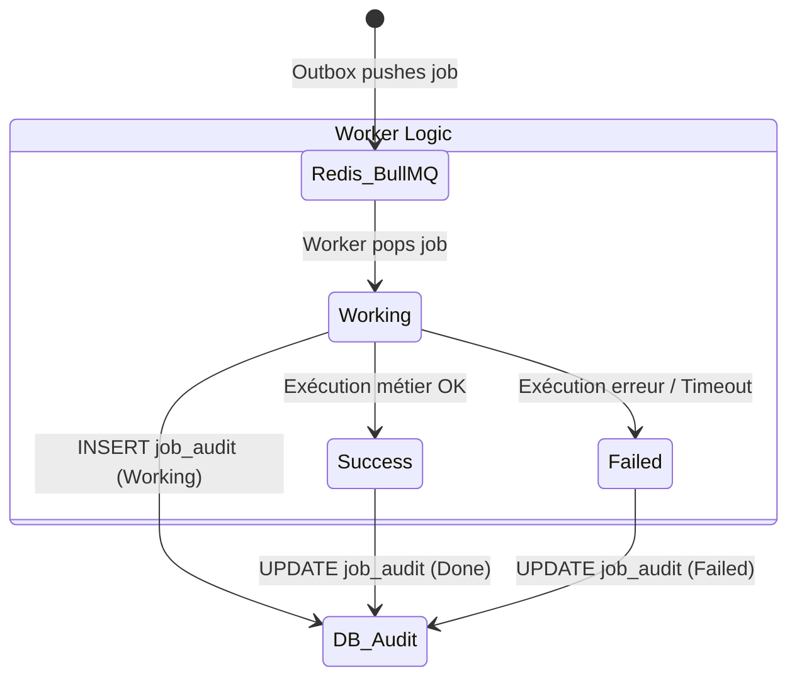

# @volontariapp/workers

## Overview & Background Processing

Le package `workers` fournit l'infrastructure de base (Base Classes, Audits, Handlers) pour l'ensemble des processus asynchrones de Volontariapp. 
Il travaille en tandem avec la librairie `@volontariapp/outbox`. Là où l'`outbox` *produit* les messages vers Redis (BullMQ), le package `workers` *consomme* et *traite* ces messages.

## Cycle de Vie d'un Job

Ce package implémente un système d'audit robuste qui enregistre les transitions d'état de chaque job dans la base de données.



## Structure des Dossiers

```text
src/
├── consumers/        # Wrappers BullMQ gérant le concurrency et la résilience
├── audits/           # Repositories pour écrire dans les tables d'audit SQL
├── handlers/         # Classes abstraites de base pour implémenter un Worker
└── test/             # Utilitaires de mock BullMQ pour les tests
```

## Exemple d'Implémentation

### Création d'un Worker Métier

Pour créer un worker dans un microservice (ou un service worker dédié), il suffit d'étendre la classe de base fournie par ce package. La base se charge de l'audit SQL et de la gestion des erreurs de manière transparente.

```typescript
import { BaseJobHandler, JobAuditService } from '@volontariapp/workers';

export class NotifyFollowersWorker extends BaseJobHandler<NotifyPayload> {
  constructor(
    auditService: JobAuditService,
    private readonly notificationService: INotificationService
  ) {
    super(auditService, 'notify-followers'); // Nom du job
  }

  // Seule la logique métier doit être implémentée
  protected async processJob(payload: NotifyPayload): Promise<void> {
    const followers = await this.notificationService.getFollowers(payload.eventId);
    
    for (const follower of followers) {
      await this.notificationService.pushNotification(follower.id, payload.message);
    }
    // L'audit "Working" et "Done" est géré automatiquement par le BaseJobHandler
  }
}
```
